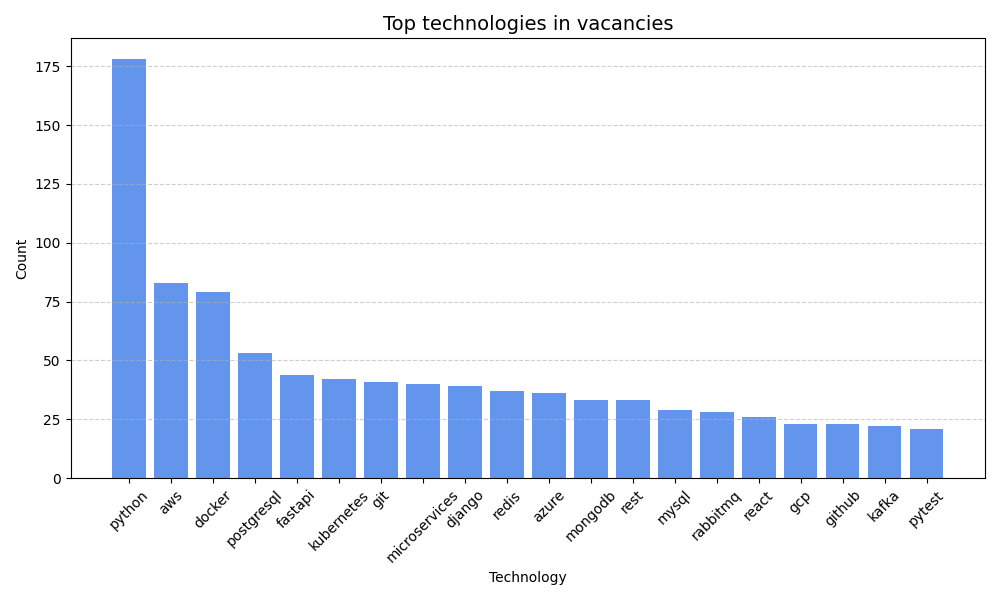

# 🕷️ Vacancies Scraper

A powerful and extensible job vacancies scraper for collecting and analyzing IT jobs from Ukrainian job boards. 
The project supports scraping from **[DOU.ua](https://jobs.dou.ua/)** and **[Work.ua](https://www.work.ua/)** and provides analytical insights on 
the most commonly mentioned technologies.

---
## 🛠 Installation

**`Python3` must be already installed**

### 🔄 Clone and set up the environment

```shell
git clone https://github.com/mykytafabrykator/vacancies-scraper.git
cd vacancies-scraper

# Create virtual environment
python -m venv venv

# Activate it
venv\Scripts\activate       # Windows
source venv\bin\activate    # macOS

# Install dependencies
pip install poetry
poetry install
```

### 🚀Run the full pipeline:

```shell
python main.py <platform> <vacancy>
```

### Platform options:
- **dou**
- **workua**

### Examples:
```shell
python main.py dou Python
python main.py workua Python Developer
```
    ⚠️ For work.ua, use max 2 words as search input.
    ⚠️ For dou, check valid search categories (e.g., Python, Java, QA) on their website.

---

## ✨ Features

- 🔎 Scrapes job listings from DOU.ua and Work.ua
- ⚙️ Supports JavaScript-rendered pages via Selenium
- 📄 Extracts:
  - Job title
  - Company name
  - Location (DOU)
  - Salary (work ua)
  - Posting date
  - Job description
  - Direct URL
- 📊 Analyzes the most mentioned technologies using NLP (`nltk`)
- 📈 Generates top-15 technology bar chart
- 🔄 One-command automated scraping + analysis + visualization

---

## ✍️ Tech Stack

- Python 3.12
- Scrapy
- Selenium
- NLTK
- Pandas & Matplotlib
- Webdriver-Manager
- Poetry

---

## 📦 Output files
- vacancies.csv – all scraped job data
- stats.csv – most mentioned tech keywords
- rating.png - horizontal bar chart of top-15 technologies

---

## 🖼️ Example output
